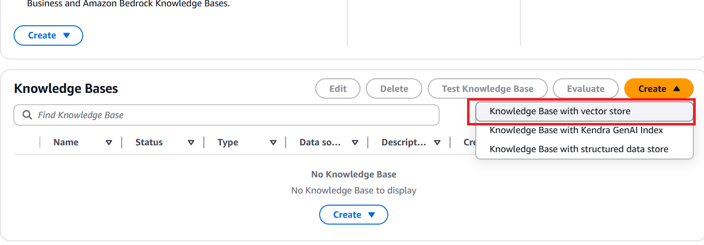
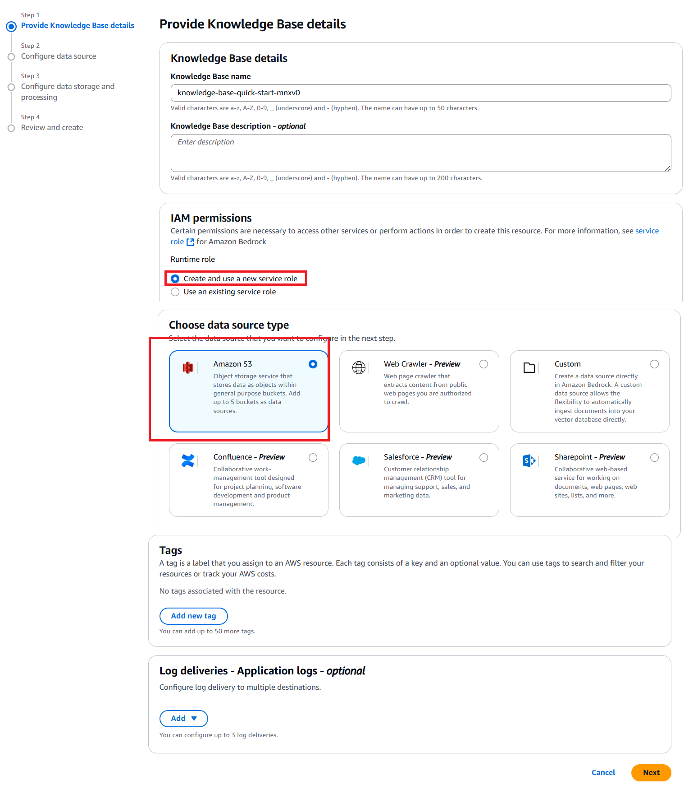
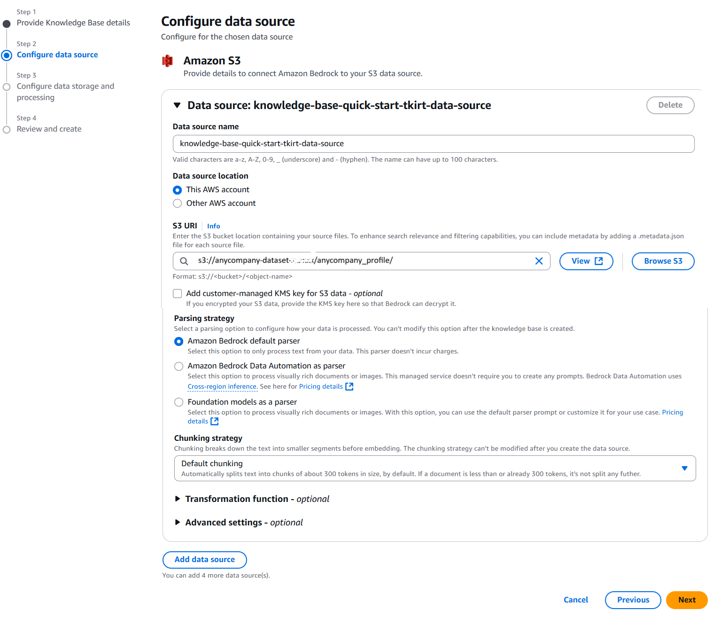
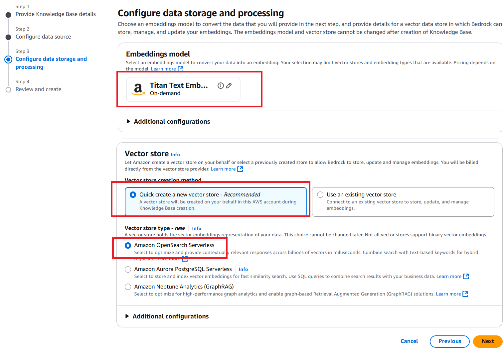
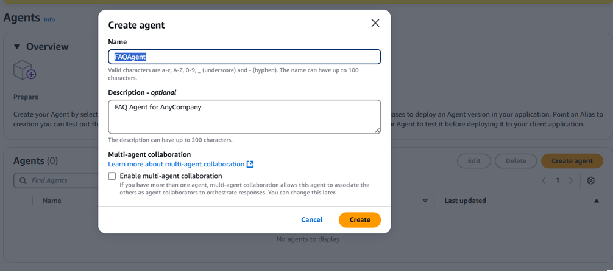
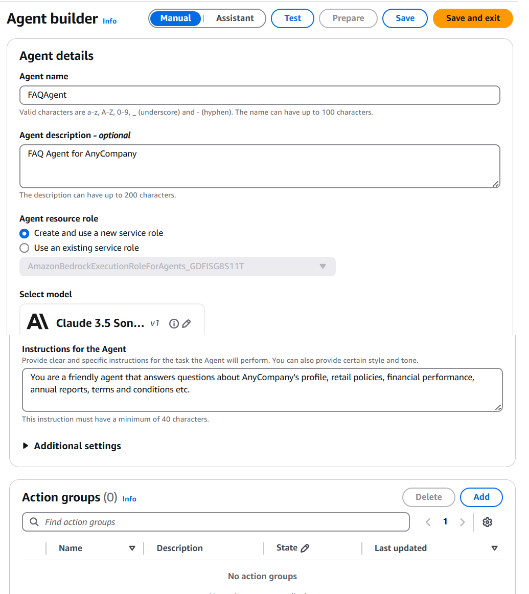
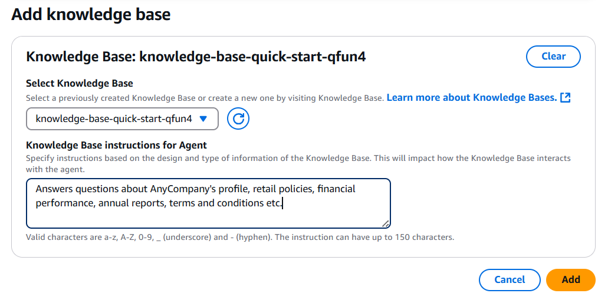
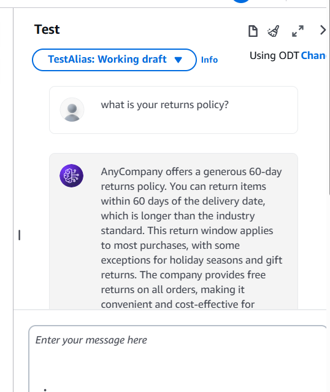

# Creating a Bedrock Agent that uses a Knowledge Base

**Amazon Bedrock Agents** is a fully managed service that enables you to create AI agents that can execute complex, multi-step tasks using foundation models. Agents can understand natural language instructions, break down complex tasks into smaller steps and orchestrate interactions between foundation models, APIs, and knowledge bases.

**Amazon Bedrock Knowledge Bases** is a fully managed service that implements Retrieval-Augmented Generation (RAG) to enhance foundation models with your private data.

In this lab you will learn how to create an [Amazon Bedrock Agent](https://aws.amazon.com/bedrock/agents/) (FAQ Agent) that can answer questions about AnyCompany's profile, retail policies, financial performance, annual reports, terms and conditions etc by querying an [Amazon Bedrock Knowledge Base](https://aws.amazon.com/bedrock/knowledge-bases/). 

This lab has two parts - 
1. Create an Amazon Bedrock Knowledge Base
2. Create an Amazon Bedrock Agent that uses the Knowledge Base created earlier


# Create an Amazon Bedrock Knowledge Base

In the first part of the workshop, you will learn how to leverage the power of [Amazon Bedrock Knowledge Bases](https://aws.amazon.com/bedrock/knowledge-bases/) to enhance the capabilities of your foundation models. You will discover how to ingest data into a knowledge base by configuring an S3 bucket as the source for the files containing data and then utilize the RAG technique to provide more relevant and accurate responses to users. By setting up the entire RAG workflow, from ingestion to retrieval and prompt augmentation, you will gain hands-on experience in leveraging the managed services offered by Amazon Bedrock, without the need to build custom integrations or manage complex data flows.


# Create Amazon Bedrock Knowledge Base using quick create option


## Create a New Knowledge Base
- In the AWS Console goto Amazon Bedrock service
- Click on Knowledge bases and click Create. Select the "Knowledge Base with a Vector store" option.




- You can keep the pre-populated value for Knowledge Base name or provide you own
- For IAM Permissions, select "Create and use a new IAM role"
- Choose Amazon S3 as the data source
- Click Next




## Configure Data Source
1. On the "Set up data source" page:
   - **Data source name**: Enter a name for your data source or use the default.
   - **S3 URI**: The documents needed for the Knowledge Base have been already uploaded into a S3 bucket. Choose the S3 bucket with the prefix "retail-assistant". Choose the folder "anycompany_profile". The final value should be like ```s3://retail-assistant-xxxxxx/anycompany_profile/```
2. Leave all other settings at their default values
3. Click "Next"


## Configure data storage and processing
1. On the this page:
   - **Embeddings model**: Select "Titan Text Embeddings V2"
   - **Vector Store creation method**: Keep the default setting "Quick create a new vector store - Recommended"
   - **Vector store type**: Keep the default setting "Amazon OpenSearch Serverless"
2. Click "Next"



## Review and create
1. Review all your configurations
1. Click "Create knowledge base"

## Wait for Creation and Sync
It will take few minutes to create the knowledge base. 
Once created, we will ingest the data from S3 into the Knowledge Base.

1. In the AWS console, open the Knowledge Base that was just created
1. In the Data source section, select Data source and click on Sync
5. Wait for the sync process to complete (status will change to "Ready")


## Test Your Knowledge Base
1. In the knowledge base details page, click on "Test knowledge base"
1. Click on Select Model and select a model
1. Enter some of the sample questions below.
  - ```What is your returns policy?```
  - ```When was the company founded?```


# Create FAQ Agent with a single Knowledge Base

In the second part of the lab you will learn how to create an [Amazon Bedrock Agent](https://aws.amazon.com/bedrock/agents/) (FAQ Agent) that can answer questions about AnyCompany's profile, retail policies, financial performance, annual reports, terms and conditions etc by querying the [Amazon Bedrock Knowledge Base](https://aws.amazon.com/bedrock/knowledge-bases/) that we created in the previous step. 

## Navigate to Bedrock Agents
1. In the Amazon Bedrock console, click on "Agents" in the left navigation pane
1. Click the "Create Agent" button

1. Provide the name "FAQAgent" and a description
1. Click on Create


## Configure Agent Details
1. On the "Agent details" page:
   -  **Agent resource role**: Select "Create and use a new service role"
   -  **Select Model**: Choose Anthropic Claude 3.5 Sonnet V1
   -  **Instructions for the Agent**: 
   ``` 
   You are a friendly agent that answers questions about AnyCompany's profile, retail policies, financial performance, annual reports, terms and conditions etc.
   ```
   - Click on "Save" button. This creates the IAM service role. 
   - 

   - After saving, populate the rest of the fields.
   - **Action Groups**: Do not select anything
   - **Memory**: Disabled
   - **Knowledge Bases**: Click on Add.
      - In the Add Knowledge Base page -
         - **Select Knowledge Base** : Select the Knowledge base we created in the previous section
         - **Knowledge Base instructions for Agent**: 
         ```
         Answers questions about AnyCompany's profile, retail policies, financial performance, annual reports, terms and conditions etc.
         ```
         - Click on Add
         
   - Leave all other fields to their default values
   - Click "Save and Exit"

## Test the Agent
- First click on the Prepare button.
- Then test the Agent by asking some questions like - 
```
What is your returns policy?
When was AnyCompany established?
Who is the CEO of AnyCompany?
What kind of products do AnyCompany sell?
What is your contact center phone number?
```



## Next
Congratulations!! You have successfully created a Bedrock Agent. Now let's move on to the next lab.