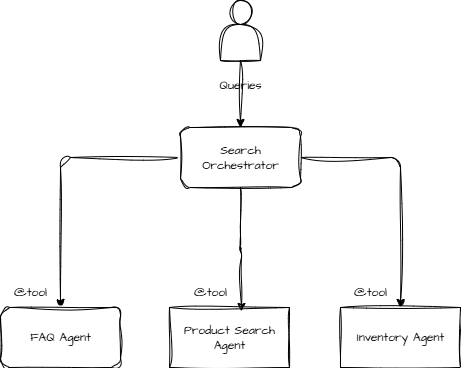

# Multi Agent Collaboration - Search Orchestrator Agent

In this Lab, we will create an Orchestrator [Strands agent](https://strandsagents.com/) that collaborates with multiple specialised agents to solve complex problems that exceed the capabilities of any single agent. 




Open the ```search_agent_orchestrator.ipynb``` notebook and execute the steps.