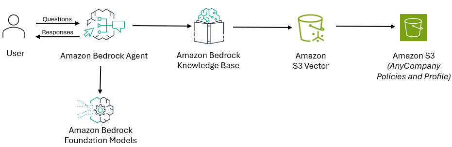

# Creating a Bedrock Agent that uses a Knowledge Base

In this lab you will learn how to create an Amazon Bedrock Agent (FAQ Agent) that can answer questions about AnyCompany's profile, retail policies, financial performance, annual reports, terms and conditions etc. The Agent will answer questions by querying an Amazon Bedrock Knowledge Base .

Refer the workshop documentation of Lab 1a to create the Bedrock Agent and Knowledge Base from the AWS Console.

## Architecture

<strong>!! Note !!</strong> 
Note down the Knowdge Base Id of the Knowledge Base that you create. That is needed in the next labs.

