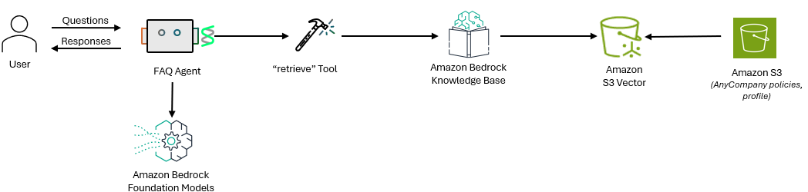

# Creating Strands Agent with a Single Knowledge Base

In this Lab, we will create a [Strands agent](https://strandsagents.com/) and integrate it with [Amazon Bedrock Knowledge Bases](https://aws.amazon.com/bedrock/knowledge-bases/). With this integration, the Agent will be able to respond to user queries about AnyCompany by finding answers from the Knowledge Base.




# Running the code
View the code `faq_strands_agent.py`. 

Run the code using -

```
python faq_strands_agent.py
```