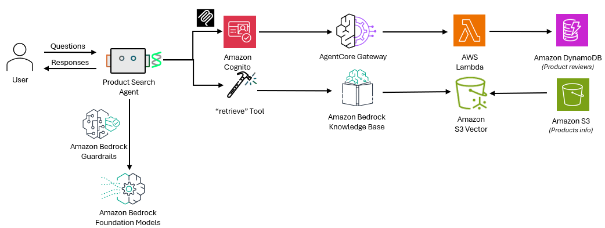

# Product Search Strands Agent

This lab demonstrates how to build an AI shopping assistant that helps customers discover products and reviews using a Knowledge Base and MCP (Model Context Protocol) tools. The agent uses Amazon Bedrock models through the Strands framework and integrates with Bedrock AgentCore Gateway to access product review services.

## Architecture



# Running the code
View the code `productsearchagent-agentcore-gw-mcp.py` and `productsearchagent-guardrail.py`. Run using the below commands -

```
python productsearchagent-agentcore-gw-mcp.py

python productsearchagent-guardrail.py
```