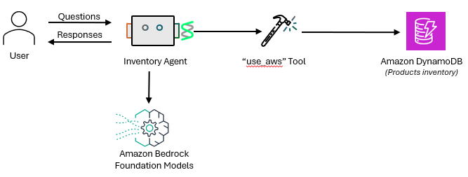

# Inventory Agent with AWS Services

This lab demonstrates how to build an inventory management agent using Strands Agents and AWS services. The agent helps customers check product availability in the inventory.

## Overview

The inventory agent is designed to:
- Check if specific products are available in stock
- Return inventory information in a structured JSON format
- Connect directly to DynamoDB to retrieve real-time inventory data

## Architecture


# Running the code
View the code `inventory_agent.py` and run using the below command -

```
python inventory_agent.py
```