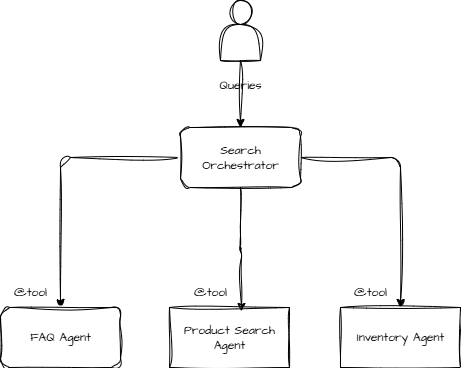
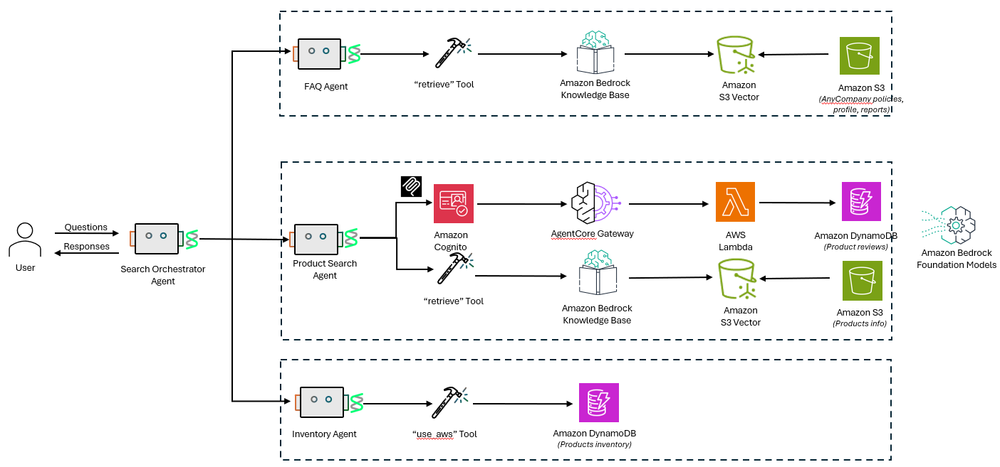

# Multi Agent Collaboration - Search Orchestrator Agent

Multi-agent collaboration is a sophisticated AI architecture where multiple specialized agents work together in a coordinated manner to solve complex problems that exceed the capabilities of any single agent. In this distributed approach, each agent brings unique expertise and capabilities to the collective system, communicating and sharing information to achieve common goals.

In this workshop, we will create a Search Orchestrator agent that will act like a team leader, coordinating with three other specialized agents:

1. FAQ Agent: For general questions about policies, procedures, or common inquiries about AnyCompany.
1. Product Search Agent: For queries related to finding specific products or product categories.
1. Inventory Agent: For questions about stock levels and availability.





## Architecture


# Running the code

Review the files `FAQAgent.py`, `InventoryAgent.py` and `ProductSearchAgent.py`.

Run the code `Orchestrator.py` using -
```
python Orchestrator.py
```